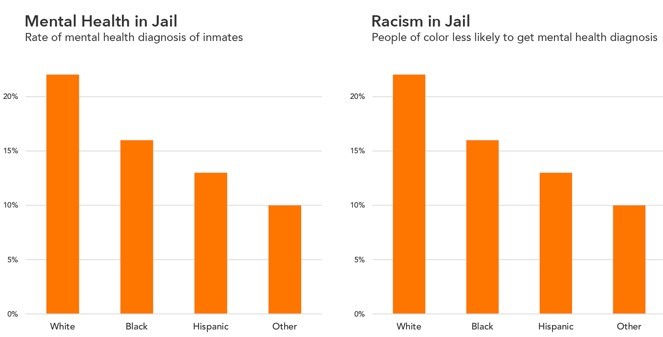

# Report on Racial Disparities in Mental Health Diagnosis Among Jail Inmates"

## By NAJAT ALNUAIMI

*Date: April 9, 2024*

## Data Viz Summary

The data visualization titled "Mental Health in Jail" and "Racism in Jail" presents two bar graphs showing the rates of mental health diagnosis among inmates, categorized by race and ethnicity. In "Mental Health in Jail," the data indicates that 23% of white inmates, 16% of Black inmates, 13% of Hispanic inmates, and 10% of other inmates receive mental health diagnoses. Conversely, in "Racism in Jail," the data shows that white inmates are diagnosed at a rate of 23%, while Black inmates are diagnosed at a rate of 16%, Hispanic inmates at 13%, and other inmates at 10%.

> "Consider the difference between these two graphics. The only variation is the title and framing of the chart..."

## Data Viz Biography

1. **Question 1:**
   The two bar graphs illustrate disparities in mental health diagnosis among inmates based on race and ethnicity.

2. **Question 2:**
   The second bar graph, titled "Racism in Jail: People of color less likely to get mental diagnosis," effectively frames the data within the context of racial disparities and names the underlying issue of racism as a contributing factor, providing a more accurate interpretation of the data.
